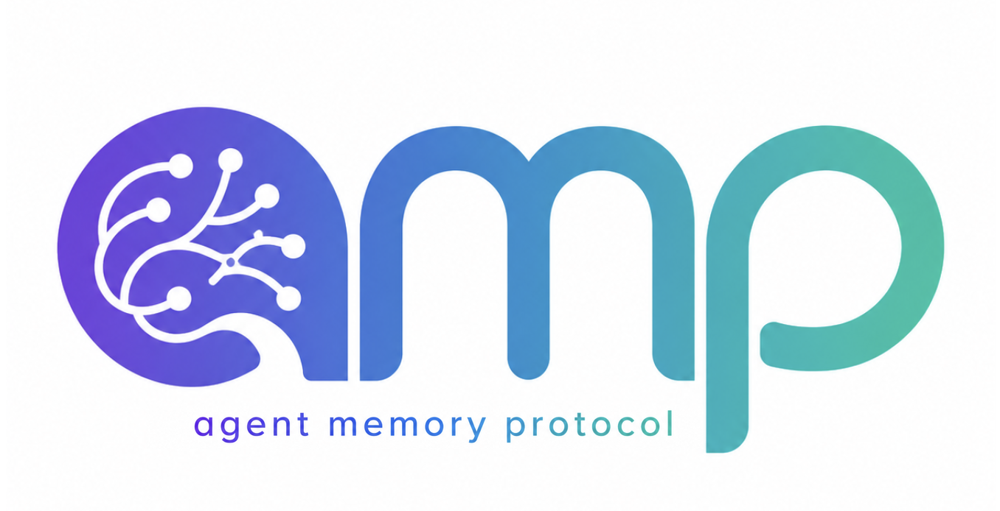

<div align="center">
  
</div>

# Agent Memory Protocol (AMP)
*By Community, Of Community, For Community*

AMP is an open specification that defines a standard interface for persistent memory in AI agent systems. Built as a set of tool definitions on top of the [Model Context Protocol (MCP)](https://modelcontextprotocol.io), AMP enables any memory backend to serve any MCP-compatible agent through a common contract.

**The problem:** Every AI memory system today re-invents the same verbs — store, retrieve, forget, organise — with incompatible schemas. An agent written for Supermemory cannot switch to smriti-memcore or Mem0 without code changes. MCP adoption alone is not interoperability.

**AMP's answer:** A six-verb interface that covers the complete memory lifecycle across backends of any complexity.

## The Six Verbs

| Verb | Description |
|------|-------------|
| `amp.encode` | Store a new memory for an agent |
| `amp.recall` | Retrieve memories relevant to a query |
| `amp.forget` | Permanently delete a memory |
| `amp.consolidate` | Trigger backend consolidation/reorganisation |
| `amp.pin` | Mark a memory as permanent (never archived) |
| `amp.stats` | Return backend statistics |

## Conformance Levels

**Core** — `amp.encode`, `amp.recall`, `amp.forget`, `amp.stats`. Sufficient for simple backends (Redis, basic vector DB).

**Full** — All six verbs. Required for backends with memory lifecycle management (consolidation, decay, pinning).

## Repository Structure

```
amp/
├── spec/amp-v1.0.md        # The specification
├── schema/amp.json         # JSON Schema for all AMP tools
├── compliance/             # Compliance test suite (pytest)
│   └── test_amp_server.py
├── examples/               # Example implementations
│   └── minimal_server.py   # Minimal Core-conformant MCP server
└── python/                 # Python reference implementation
    └── amp-server/         # smriti-memcore AMP wrapper (Full-conformant, install from source)
```

## Quick Start

### Running the minimal example server

```bash
python3 examples/minimal_server.py
```

No external dependencies — pure Python stdlib. The server speaks the MCP wire protocol (JSON-RPC 2.0 over stdio) manually: it handles `initialize`, `tools/list`, and `tools/call` without using the `mcp` Python package. This is intentional — it shows that AMP is a protocol convention, not a library dependency.

> **Note:** `examples/minimal_server.py` is a teaching tool, not a production server. For a production AMP backend, use the [`mcp` Python package](https://pypi.org/project/mcp/) (Anthropic's official SDK) to get full protocol compliance. See [`python/amp-server/`](python/amp-server/README.md) for the Full-conformant reference implementation.

### Running the compliance suite against your server

```bash
pip install pytest
pytest compliance/test_amp_server.py --server-cmd "python3 your_server.py"
```

The compliance suite speaks raw MCP over stdio — it performs the full MCP handshake (`initialize` + `notifications/initialized`) and then sends `tools/call` messages directly, so it works against any AMP server regardless of which MCP SDK it uses internally (including FastMCP-based servers).

### Implementing your own backend

1. Implement the four Core verbs (`amp.encode`, `amp.recall`, `amp.forget`, `amp.stats`) as MCP tools using any MCP SDK or the raw wire protocol
2. Declare conformance in your MCP server manifest:
   ```json
   {
     "name": "my-memory-backend",
     "amp_conformance": "core",
     "amp_version": "1.0"
   }
   ```
3. Run the compliance suite to verify

## Reference Implementation

[`amp-server`](python/amp-server/README.md) is the reference Full-conformant AMP implementation (install from source — see [`python/amp-server/`](python/amp-server/README.md)). It wraps [smriti-memcore](https://pypi.org/project/smriti-memcore/) — providing hybrid FTS5+vector retrieval with RRF fusion, multi-hop Semantic Palace graph traversal, spaced-repetition decay, and background consolidation — and exposes all six AMP verbs over MCP stdio.

> **Note:** smriti-memcore v1.2.0+ exposes both its native `smriti_*` tools and the AMP verb aliases (`amp.encode`, `amp.recall`, etc.) on the same MCP server — no separate install needed.

## Specification

See [spec/amp-v1.0.md](spec/amp-v1.0.md) for the full specification.

## Status

v1.0 — 2026-05-14. Ready for community implementation and feedback.

Open questions and next steps are tracked in [spec/amp-v1.0.md § Open Questions](spec/amp-v1.0.md#9-open-questions).

## License

This specification and all code in this repository are released under the [MIT License](LICENSE).

---

*AMP is an independent open specification. It is not affiliated with Anthropic or the MCP project.*
